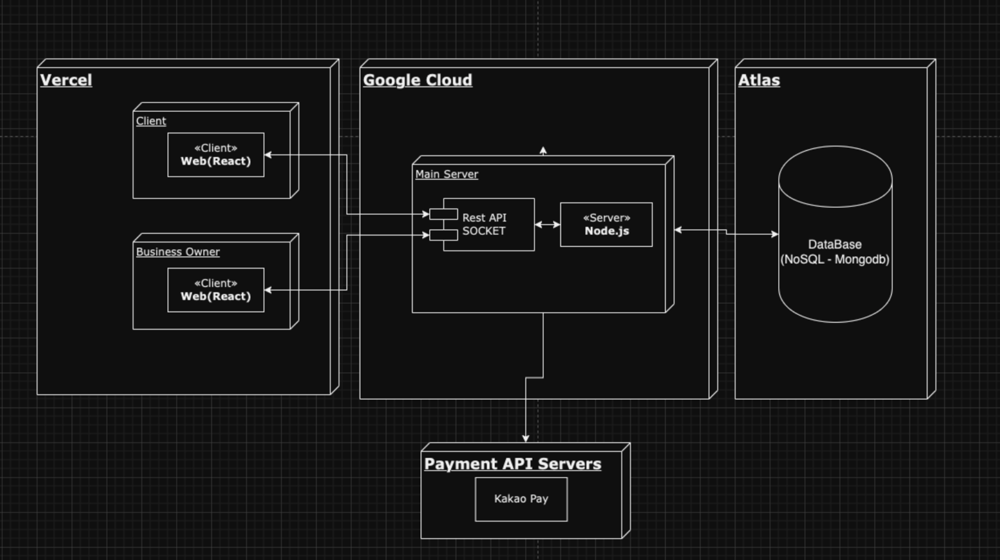
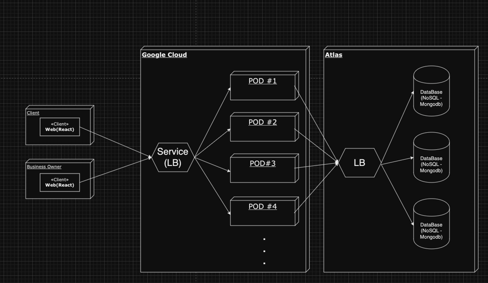

# AJOU-Eats
2023년 가을학기, 아주대학교 웹시스템설계 팀프로젝트 10팀 서버 코드입니다.
Nodejs를 활용하여 온라인 사전주문 웹 시스템의 프로토타입을 구현하였습니다.

## 👨‍🏫 프로젝트 소개
식당의 긴 대기 시간과, 특정 시간대의 주문 몰림 현상을 개선하기 위해 캠퍼스 온라인 주문 시스템을 개발하였습니다.
## ⏲️ 개발 기간 및 배경
- 2023.11.01(수) ~ 2023.12.09(토)
- Motivation
    - 아주대학교 내 식당 및 카페에서 대기 시간이 길어져 학생들과 교직원들에게 불편함이 있습니다.
    - 효율적이고 빠른 주문 시스템이 도입된다면 대학 커뮤니티의 편의성이 크게 향상될 것으로 예상됩니다.

## 🧑‍🤝‍🧑 개발자 소개 및 역할
- **김관주** : 소프트웨어학과(20), 데이터베이스 관리, 유저 관리 기능 구현, DevOps(k8s,GCP)
- **한승훈** : 소프트웨어학과(19), 주문 관리, 카카오페이 데모 결제, 주문정보 전송 소켓 기능 구현 
 
## 💻 개발환경
- **Version** : Node.js 14
- **IDE** : Visual Studio Code, Intellij
- **Framework** : Express.js
- **ORM** : Mongoose

## ⚙️ 기술 스택
- **Server** : Google Kubernetes Engine (GKE) on Google Cloud Platform (GCP)
- **DataBase** : MongoDB
- **WS/WAS** : Node.js, Express.js

## 📝 프로젝트 아키텍쳐

## 📌 주요 기능

- 유저용 
  1. **매장 조회**: 교내 식당 및 카페를 맵 위에서 리스트업 합니다.
  2. **실시간 메뉴 조회**: 식당 및 카페의 현재 메뉴를 실시간으로 확인 가능합니다.
  3. **온라인 주문 & 결제**: 선택한 메뉴에 대해 온라인으로 주문 및 결제를 진행합니다.
  4. **주문 대기확인:** 현재 주문의 대기 순번을 실시간으로 확인 가능합니다.
  5. **픽업 알림**: 주문이 준비되면 사용자에게 픽업 알림이 전송됩니다.
    
- 사업자용
    1. **주문 관리**: 접수된 주문을 확인하고 관리 가능.
    2. **메뉴 관리**: 식당 및 카페의 메뉴 및 가격 수정, 추가, 삭제 가능.

## ✒️ API

- [API 상세 설명](https://git.ajou.ac.kr/ajou-pay/server/-/wikis/API-docs) 

| Method | URI                       | Description    |
|--------|---------------------------|----------------|
| GET    | `/api/shop`               | 전체 매장 조회       |
| GET    | `/api/shop/{shopId}` | 매장 조회          |
| GET    | `/api/shop/{shopId}/menu` | 특정 가게 전체 메뉴 조회 |
| GET    | `/api/menu`                   | 전체 메뉴 조회       |
| GET    | `/api/menu/{menuId}`          | 특정 메뉴 조회       |
| GET    | `/api/order`                  | 유저의 주문 현황      |
| POST   | `/api/order`                  | 카카오페이 결제 요청    |
| POST   | `/api/order/approve`          | 카카오페이 결제 검증요청  |
| GET    | `/api/admin/order`            | 가게 주문정보 조회     |
| PATCH  | `/api/admin/order`            | 주문 상태 변경       |
| POST   | `/api/user/login`             | 유저 로그인         |
| POST   | `/api/user/register`          | 유저 회원가입        |
| PUT    | `/api/user/{userId}`          | 유저 정보 업데이트     |
| GET    | `/api/user/logout`            | 유저 로그아웃        |
